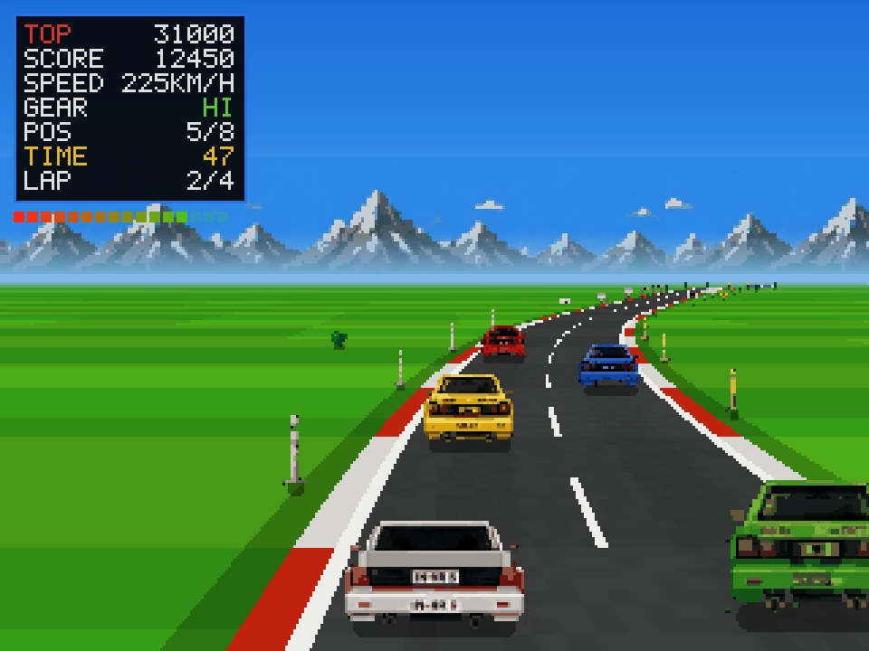
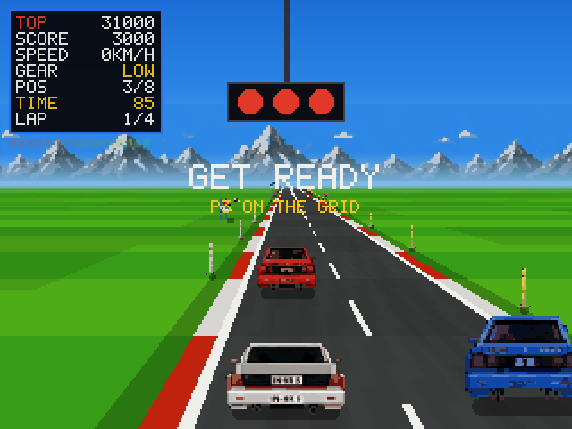
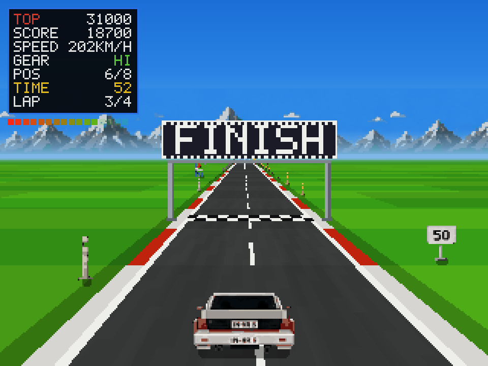
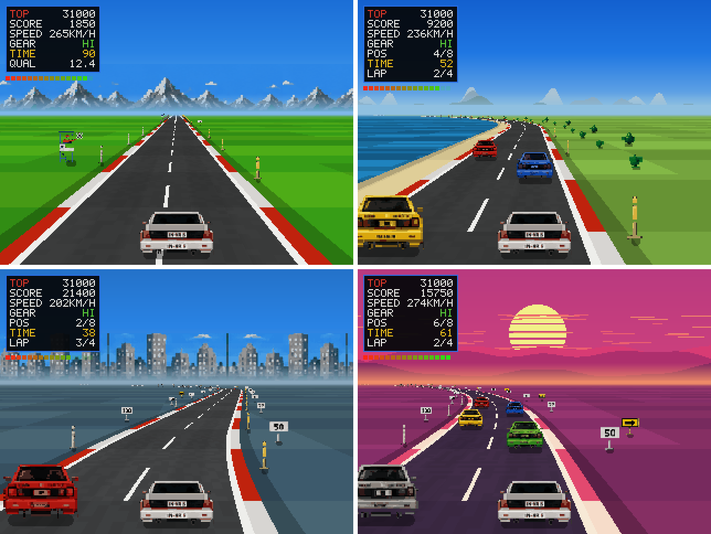
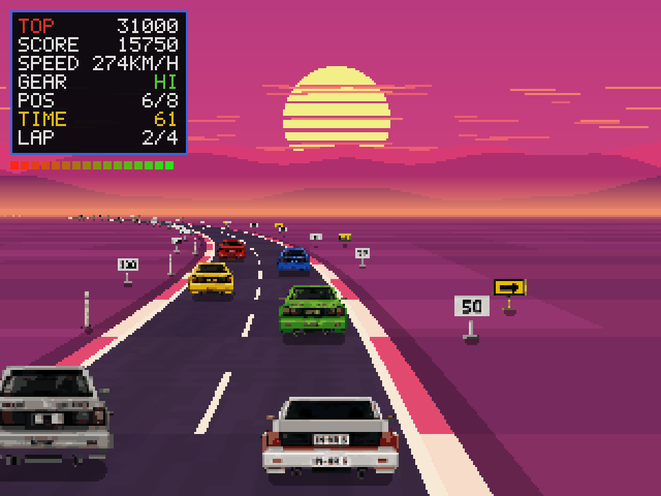

# Quattro GP

A 1982-style arcade racer for [Omarchy](https://omarchy.org) 4's shell.
Pixel-art sprites over a GPU-shaded road, rendered at 320x240 and magnified by
a whole number of pixels. Four circuits, a qualifying lap, an eight-car field,
checkpoint time extends, puddles that reflect each circuit's own sky and cost
you grip at speed, and a five-deep ranking table per circuit — initials
entered before you race, arcade style — that survives a shell restart.





Three arches a lap — the sponsor board twice, and FINISH over the line:



Four circuits — Fuji, Seaside, City and Sunset:



## Install

```bash
omarchy plugin add https://github.com/28allday/Quattro-GP-Omarchy.git --enable
```

Then click the 🏁 in the bar, or:

```bash
omarchy-shell shell toggle nosignal.quattro-gp
```

To bind it to a key, add to `~/.config/hypr/bindings.lua`:

```lua
hl.bind("SUPER ALT, G", "exec", "omarchy-shell shell toggle nosignal.quattro-gp")
```

## Remove

```bash
omarchy plugin disable nosignal.quattro-gp
omarchy plugin remove nosignal.quattro-gp
```

The plugin keeps its ranking tables and driver name in
`~/.local/state/quattro-gp/state.json`; delete that too if you want the
scores gone. Nothing else is written anywhere, beyond the plugin's own
entries in `~/.config/omarchy/shell.json`, which `disable` clears — run it
a second time if the bar icon was already gone.

## Controls

| Key | Action |
|-----|--------|
| **Left / Right** or **A / D** | Steer — and pick the circuit, and spell your initials |
| **Up** / **W** / **Z** | Accelerate |
| **Down** / **S** / **X** | Brake |
| **Space** or **Shift** | Shift between LOW and HI |
| **Enter** | Open the course menu, lock a letter, start |
| **Escape** or **Q** | Back out of a menu; anywhere else, close the cabinet |

Closing the cabinet — Escape, or clicking outside it — pauses a race rather
than losing it; reopening from the bar carries on where you were. Escape
itself also resets to the title, so the 🏁 always greets you with a fresh
cabinet.

## How it plays

**Say who is driving.** Pick a circuit and the cabinet asks for three
initials before you touch the track — left/right spins the letter, Enter
locks it, and the name arrives prefilled with whoever drove last, so a
returning driver is three Enters from the grid. A score that makes a
circuit's top five files itself under that name, and the attract screen
cycles the BEST DRIVERS table for whichever circuit is up.

**Mind the lights.** The field leaves on the green, and the game penalises a
jumped start: throttle before the lights go green and the engine is held
dead for two seconds while everyone drives away.

**Shift gear.** Two positions, like the cabinet's lever. LOW pulls hard off the
line and dies at 168km/h; HI has nothing at low speed and everything at the top.
Stay in LOW and a lap takes 94 seconds — you will not qualify. Shift up at
around 100mph, as the arcade's own advice had it.

**Qualify.** Ninety seconds of driving at Fuji, and a lap in 73 or the game is
over before it starts — every circuit sets its own pair. Beat it and your time sets your slot on the grid, from pole to
eighth, against seven rivals — a scrappy lap means six cars to fight past.

**Then four laps**, with the clock topped up each time you cross the line. Fifty
points a car passed, fifty every twenty metres, and two hundred for every second
still on the clock at the finish.

**Corners have to be driven.** Ask for more grip than the wheel can give and the
car lets go — no steering for the best part of a second while the corner throws
you wide. Fuji's hairpin will not take more than about 235km/h; the 300R will
take anything. Off the tarmac you will not pull much over 100km/h, and the
roadside furniture is solid: the verge costs you time, a sign costs you the car.

**And watch for water.** Three puddles a lap stand on the racing line,
reflecting whatever sky that circuit has. Hit one at speed and it takes your
grip exactly like an overcooked corner; they sit on straights where you can
see them coming, so going around is always on offer.

Fuji here is 4360m against the real circuit's 4359m. A tidy lap is around 65
seconds.

## Courses

Four circuits, chosen before the qualifying lap with left/right and Enter.

| | length | qualify in | character |
|---|---|---|---|
| **FUJI** | 4360m | 73s | the original |
| **SEASIDE** | 4500m | 71s | long radius, nothing tight |
| **CITY** | 3800m | 70s | fifteen features, no room to recover |
| **SUNSET** | 4900m | 74s | the longest straight, and one nasty left |



Each carries its own palette, backdrop and roadside furniture, and its own
qualifying target — a single 73s/90s pair only means anything for a 4360m lap.
The targets are measured rather than picked, calibrated so every circuit
leaves the same margin.

The ranking tables are kept per circuit, since a Sunset score and a City
score are not the same achievement.

The artwork is generated, not drawn by hand. See [art/CREDITS.md](art/CREDITS.md).

## Name and marks

*Pole Position* is a trademark of Bandai Namco, and Audi's marks are Audi's.
Neither appears here: this is an original game, and the player's car is an
unbadged Group-B-shaped rally car. See [art/CREDITS.md](art/CREDITS.md).

**"Quattro" here is Omarchy 4's own codename**, which is where the title came
from — the plugin id is `nosignal.quattro-gp`, alongside the other Quattro-era
plugins. It is not a reference to the car, and the game names no manufacturer.

This is a game *in the style of* the 1982 arcade racers, not a port or a
conversion of one. Nothing here is derived from any original's code or assets:
the rules were researched from the public sources listed below, and the
artwork is generated by the scripts in [`art/`](art/).

## What the original did

The rules here are researched, not remembered — one circuit (Fuji), 90 seconds
of qualifying with a 73-second target, seven rivals, a grid slot from your
qualifying time, a two-speed gearbox, puddles on the racing line, 50 points a
car passed and 200 a second left on the clock.

- [Pole Position — Wikipedia](https://en.wikipedia.org/wiki/Pole_Position)
- [Pole Position II — Wikipedia](https://en.wikipedia.org/wiki/Pole_Position_II)
- [Pole Position strategy guide — GameFAQs](https://gamefaqs.gamespot.com/arcade/583792-pole-position/faqs/1287)
- [DIP switch settings — Museum of the Game](https://www.arcade-museum.com/dipswitch-settings/pole-position)
- [Top speed by board revision — Arcade Museum forums](https://forums.arcade-museum.com/threads/pole-position-rom-245-mph.324084/)

## Licence

MIT.
